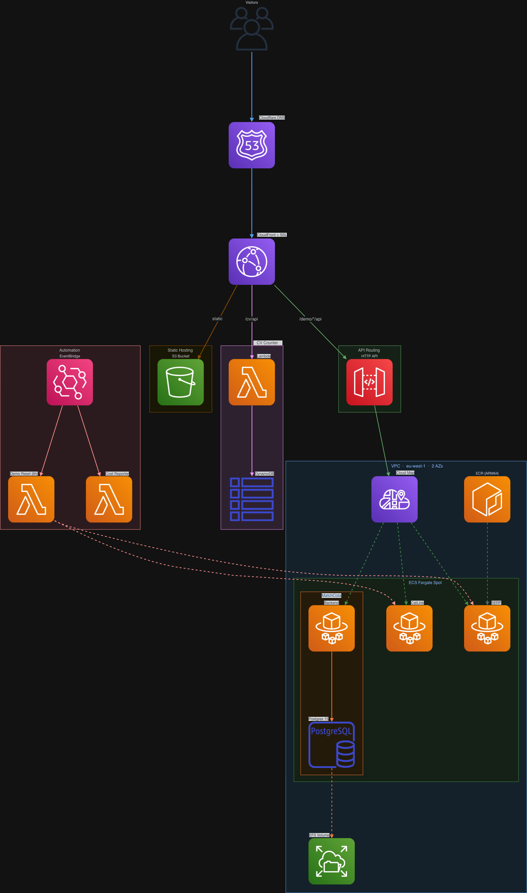

# Portfolio Infrastructure — asanchezbl.dev

Infrastructure-as-Code and CI/CD automation behind my personal portfolio at [asanchezbl.dev](https://asanchezbl.dev). Everything is managed with Terraform, deployed automatically via GitHub Actions, and runs serverless on AWS.

## Live

| URL | What |
|-----|------|
| [asanchezbl.dev](https://asanchezbl.dev) | Landing page |
| [asanchezbl.dev/cv](https://asanchezbl.dev/cv/) | CV — PDF download (ES / EN / CA) + visit counter |
| [asanchezbl.dev/portfolio](https://asanchezbl.dev/portfolio) | Portfolio |
| [asanchezbl.dev/demo/serp](https://asanchezbl.dev/demo/serp/) | SERP — Emergency Response System (live demo) |
| [asanchezbl.dev/demo/catlink](https://asanchezbl.dev/demo/catlink/) | CatLink — AI EV Charger Agent (live demo) |
| [asanchezbl.dev/demo/matchcota](https://asanchezbl.dev/demo/matchcota/) | MatchCota — Pet Adoption Platform (live demo) |

## Architecture



Traffic enters through **Cloudflare DNS** and hits **CloudFront**, which handles SSL (ACM) and security headers. CloudFront routes requests to three origins based on path:

- **S3** serves all static content: landing page, portfolio, CV PDFs, three SPA frontends, and assets
- **Lambda + DynamoDB** handles the CV visit counter
- **API Gateway HTTP API** routes demo API requests through a VPC Link to **Cloud Map**, which discovers the backend services

Inside the VPC (eu-west-1, 2 AZs), three **ECS Fargate Spot** tasks run the demo backends (SERP, CatLink, MatchCota). MatchCota includes a Postgres 15 sidecar container with persistent storage on **EFS**. All images are ARM64 (Graviton) stored in **ECR**.

Two **EventBridge** scheduled rules drive automation: a Lambda resets SERP and CatLink demo data every 6 hours, and another sends a weekly cost report to Discord.

## Stack

| Layer | Technology |
|-------|-----------|
| CDN / SSL | CloudFront + ACM (auto-renewal, TLSv1.3) |
| DNS | Cloudflare (DNS-only) |
| Static hosting | S3 (OAC, private bucket) |
| API routing | API Gateway HTTP API (path rewriting, throttling) |
| Compute | ECS Fargate Spot (ARM64), Lambda |
| Database | DynamoDB (CV counter), PostgreSQL 15 (MatchCota sidecar on EFS) |
| Container registry | ECR (4 repos, lifecycle policies) |
| IaC | Terraform (102 resources, S3 backend) |
| CI/CD | GitHub Actions (OIDC auth, auto-deploy on push) |
| Monitoring | CloudWatch Logs (7-day retention), weekly cost reports via Discord |
| Budget | AWS Budgets alert at $15/month |

## Repository Structure

```
.
├── .github/workflows/
│   └── deploy.yml              # CI/CD: auto-deploy on push to main
│
├── terraform/                  # All AWS infrastructure
│   ├── cloudfront.tf           # CDN, behaviors, response headers, CF Function
│   ├── s3_static.tf            # Static hosting bucket
│   ├── ecs.tf                  # Fargate cluster, task defs, services, EFS
│   ├── api_gateway.tf          # HTTP API, routes, VPC Link
│   ├── ecr.tf                  # Container registries + lifecycle policies
│   ├── acm.tf                  # SSL certificate (us-east-1)
│   ├── lambda.tf               # CV counter + demo reset Lambdas
│   ├── cost_reporter.tf        # Weekly cost report Lambda
│   ├── dynamodb.tf             # CV visit counter table
│   ├── github_oidc.tf          # GitHub Actions OIDC + IAM role
│   ├── vpc.tf                  # VPC, 2 public subnets, IGW
│   ├── dns.tf                  # Cloudflare DNS records
│   ├── budget.tf               # Cost alerts
│   └── providers.tf / variables.tf / outputs.tf
│
├── lambda/
│   ├── cost_reporter/          # Weekly AWS cost digest → Discord
│   ├── cv_counter/             # Visit counter (DynamoDB)
│   └── demo_reset/             # ECS force-redeployment (every 6h)
│
├── web/
│   ├── landing/                # Landing page (HTML, robots.txt, sitemap)
│   ├── portfolio/              # Portfolio page (HTML, CSS, JS)
│   ├── cv-page/                # Static CV page with counter JS
│   └── cv-service/             # PDF generator (WeasyPrint, local use only)
│
├── docker/
│   ├── serp/                   # Mock patches + docker-compose for SERP
│   ├── catlink/                # Mock patches + docker-compose for CatLink
│   └── matchcota/              # Dockerfile, entrypoint, seed data for MatchCota
│
├── assets/
│   ├── images/                 # Portfolio screenshots
│   ├── photos/                 # Personal photos (team, events)
│   └── certificates/           # Certification docs
│
└── scripts/
    ├── ci-build.sh             # CI: patch source, build images → ECR, SPAs → S3
    └── build-and-push.sh       # Local: same as ci-build.sh but for macOS
```

## CI/CD

Push to `main` triggers GitHub Actions automatically. The workflow detects what changed and runs the right job:

| Changed files | What happens |
|---|---|
| `web/**` or `assets/**` | Syncs to S3, invalidates CloudFront |
| `lambda/**` | Zips and updates Lambda function code |
| `docker/**` or `scripts/ci-build.sh` | Clones source repos, applies patches, builds ARM64 images → ECR, builds SPAs → S3, redeploys ECS |

Authentication uses GitHub OIDC federation — no stored AWS credentials. The IAM role is scoped to specific resources and cannot run `terraform apply` or modify IAM.

## Cost

Running at **~$3-6 USD/month** (covered by AWS credits):

| Resource | ~Cost |
|----------|-------|
| ECS Fargate Spot (3 tasks) | ~$2-4/mo |
| CloudFront | $0-1/mo |
| Cloud Map | ~$0.40/mo |
| S3 + EFS + ECR | ~$0.10/mo |
| Lambda + DynamoDB + EventBridge | $0 (free tier) |
| ACM + API Gateway | $0 |

No ALB ($16/mo), no NAT Gateway ($32/mo), no RDS ($14/mo after free tier). Every cost decision is documented in the migration strategy.

## Security

- CloudFront security headers: HSTS, CSP, X-Frame-Options, Permissions-Policy, nosniff
- ACM TLS 1.3, auto-renewal
- API Gateway throttling (rate limiting)
- ECS tasks in VPC, security groups restrict inbound to VPC CIDR
- GitHub Actions OIDC — no long-lived credentials
- IAM least-privilege: each Lambda/ECS role scoped to specific resources
- EFS encrypted at rest
